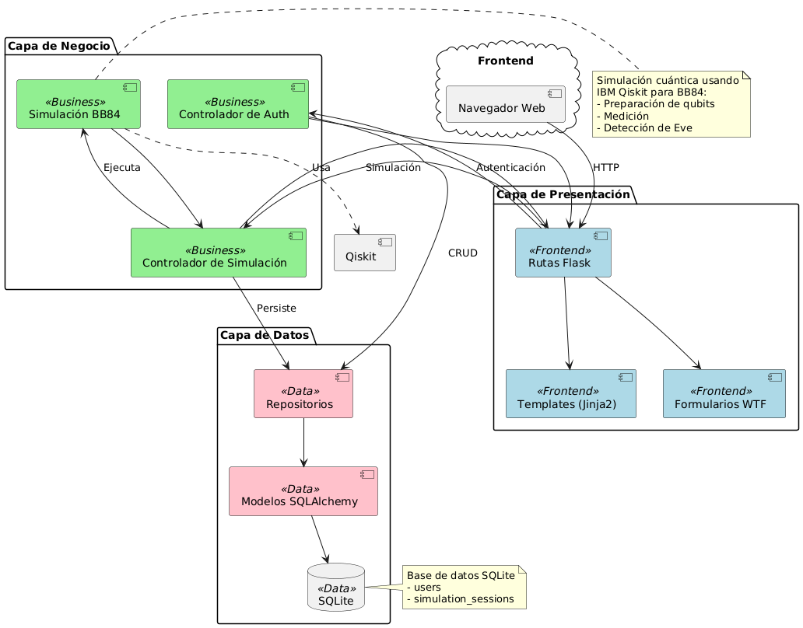

<div align="center">

# 🔐 Q-Sec: Interactive BB84 Quantum Key Distribution Simulator

### *Information-Theoretically Secure Quantum Communications, Channel Decoherence & Asymptotic Key Rate Estimation*

[](https://www.python.org/)
[](https://flask.palletsprojects.com/)
[](https://qiskit.org/)
[](https://github.com/Qiskit/qiskit-aer)
[](https://opensource.org/licenses/MIT)
[](tests/)

<p align="center">
  <a href="#-executive-summary">Executive Summary</a> •
  <a href="#-mathematical--quantum-foundations">Quantum Foundations</a> •
  <a href="#-preset-experiments--zero-friction-guest-mode">Presets & Demo</a> •
  <a href="#%EF%B8%8F-system-architecture">Architecture</a> •
  <a href="#-installation--usage">Quick Start</a> •
  <a href="#-academic-citation">Citation</a>
</p>

</div>

---

## 🔬 Executive Summary

**Q-Sec** is an open-source, research-grade web simulation platform for **Quantum Key Distribution (QKD)** adhering to the **Bennett-Brassard 1984 (BB84)** protocol. Built with **IBM Qiskit 2.2**, **Qiskit-Aer**, and **Flask**, Q-Sec models real-time quantum circuit construction, single-photon quantum state preparation across conjugate non-orthogonal bases, environmental quantum channel decoherence, and active adversarial interception (Eve).

Developed to bridge foundational quantum physics with modern cryptographic network engineering, Q-Sec computes rigorous quantum information-theoretic metrics—including **Shannon binary entropy** and the **asymptotic Secret Key Rate** under one-way classical post-processing ($R \ge 1 - 2h(\text{QBER})$). The platform was peer-reviewed and presented at the **National Conference on Information Engineering and Information Systems (CoNaIISI 2026)**.

---

## ⚛️ Mathematical & Quantum Foundations

### 1. Quantum State Preparation & Encoding
Alice generates independent identically distributed (i.i.d.) random classical bits $b_i \in \{0, 1\}$ and encoding bases $\theta_A \in \{\boxplus, \boxtimes\}$. Quantum states $|\psi\rangle$ are prepared on the Bloch sphere as:

$$\begin{aligned}
\text{Rectilinear Basis } (\boxplus): \quad & |0\rangle = \begin{pmatrix} 1 \\ 0 \end{pmatrix}, \quad |1\rangle = X|0\rangle = \begin{pmatrix} 0 \\ 1 \end{pmatrix} \\
\text{Diagonal Basis } (\boxtimes): \quad & |+\rangle = H|0\rangle = \frac{|0\rangle + |1\rangle}{\sqrt{2}}, \quad |-\rangle = H|1\rangle = \frac{|0\rangle - |1\rangle}{\sqrt{2}}
\end{aligned}$$

where $X = \begin{pmatrix} 0 & 1 \\ 1 & 0 \end{pmatrix}$ and $H = \frac{1}{\sqrt{2}}\begin{pmatrix} 1 & 1 \\ 1 & -1 \end{pmatrix}$.

### 2. Quantum Channel & Depolarizing Noise
To model realistic networked optical fiber or free-space quantum channels subject to thermal fluctuations and fiber birefringence, Q-Sec implements a single-qubit **depolarizing quantum channel** $\mathcal{E}_\epsilon$ using `qiskit_aer.noise`:

$$\mathcal{E}_\epsilon(\rho) = (1 - \epsilon)\rho + \frac{\epsilon}{3}\left(X\rho X + Y\rho Y + Z\rho Z\right)$$

where $\epsilon \in [0, 1]$ represents the depolarizing error rate parameter.

### 3. Projective Measurement & Wave-Function Collapse
Bob independently selects measurement bases $\theta_B \in \{\boxplus, \boxtimes\}$. Projective measurement outcomes in the diagonal basis are executed via unitary basis rotation followed by computational Z-basis projection:

$$P_{0} = |0\rangle\langle 0|, \quad P_{1} = |1\rangle\langle 1|$$

By the **No-Cloning Theorem** and Heisenberg uncertainty, an eavesdropper measuring in a mismatched basis irreversibly perturbs the density operator, inducing errors on Bob's measurement outcomes.

### 4. Sifting & Quantum Bit Error Rate (QBER)
Over an authenticated public classical channel, Alice and Bob reconcile bases. The sifted index set $\mathcal{S} = \{i : \theta_{A,i} = \theta_{B,i}\}$ yields the sifted key. A non-disclosed random test sample $\mathcal{T} \subset \mathcal{S}$ is sacrificed to compute the parameter estimation metric:

$$\text{QBER} = \frac{1}{|\mathcal{T}|} \sum_{j \in \mathcal{T}} |a_j \oplus b_j|$$

Under an ideal channel without eavesdropping, $\text{QBER} = 0\%$. Under a standard intercept-resend attack with Eve intercepting each qubit, $\mathbb{E}[\text{QBER}] = 25\%$.

### 5. Asymptotic Secret Key Rate
Under the Shor-Preskill and Devetak-Winter security proofs for one-way forward classical error correction and privacy amplification, the asymptotic secret key fraction $R$ per sifted bit satisfies:

$$R \ge \max\left(0, 1 - 2 \cdot h(\text{QBER})\right)$$

where $h(p)$ is the Shannon binary entropy function:

$$h(p) = -p \log_2(p) - (1 - p) \log_2(1 - p), \quad \text{with } h(0) = h(1) = 0$$

If $\text{QBER} \ge 11.00\%$ (the Shor-Preskill threshold), $1 - 2h(\text{QBER}) \le 0$, and the asymptotic secret key rate drops strictly to $R = 0$, mandating protocol abort.

---

## ⚡ Preset Experiments & Zero-Friction Guest Mode

Q-Sec provides instant access without mandatory registration or login. Evaluators, researchers, and students can run live simulations in-memory:

| Preset | Scenario | Configuration | Expected Outcome |
|---|---|---|---|
| **Preset 1** | **Ideal Quantum Channel** | 20 qubits, No Eve, Noise $\epsilon = 0.0$ | $\text{QBER} \approx 0.0\%$, $R \approx 1.0$, Secure Key Extracted |
| **Preset 2** | **Eavesdropping Attack** | 20 qubits, Eve Active, Noise $\epsilon = 0.0$ | $\text{QBER} \approx 25.0\%$, $R = 0.0$, Aborted / Compromised |
| **Preset 3** | **Noisy Environment** | 20 qubits, No Eve, Noise $\epsilon = 0.15$ | Environmental Decoherence, $\text{QBER} > 11.0\%$, $R = 0.0$ |

---

## 🏗️ System Architecture

Q-Sec follows a modular, 3-tier enterprise and academic architecture:

```
┌─────────────────────────────────────────────────────────────┐
│                   PRESENTATION LAYER                        │
│   Jinja2 Templates (HTML5 / Bootstrap 5 / SVG Visualizer)   │
│   Routes & REST API (/simulator, /animation, /api/run-*)   │
└──────────────────────────────┬──────────────────────────────┘
                               │
┌──────────────────────────────▼──────────────────────────────┐
│                    BUSINESS ENGINE                          │
│   • Simulation Controller: Orchestration & In-Memory Cache  │
│   • BB84 Simulation Engine: Qiskit Circuit Synthesis       │
│   • Noise Modeling: qiskit_aer.noise.depolarizing_error     │
│   • Information Metrics: Shannon Entropy & Secret Key Rate  │
└──────────────────────────────┬──────────────────────────────┘
                               │
┌──────────────────────────────▼──────────────────────────────┐
│                     DATA ACCESS LAYER                       │
│   • SQLAlchemy ORM (User & SimulationSession Entities)      │
│   • Auto-Schema Migrations (datos/esquema.py)              │
│   • Engine-Agnostic Storage: SQLite3 / PostgreSQL / MySQL   │
└─────────────────────────────────────────────────────────────┘
```

---

## 🚀 Installation & Usage

### Prerequisites
- Python 3.9 or higher
- `pip` package manager
- `git`

### 1. Clone the Repository
```bash
git clone https://github.com/SrNanu/Q-sec.git
cd Q-sec
```

### 2. Configure Virtual Environment
```bash
# Windows
python -m venv venv
venv\Scripts\activate

# macOS / Linux
python3 -m venv venv
source venv/bin/activate
```

### 3. Install Dependencies
```bash
pip install -r requirements.txt
```

### 4. Run Automated Test Suite
Verify mathematical correctness and regression safety across all 96 unit, integration, and noise-modeling tests:
```bash
pytest -v
```

### 5. Launch Local Development Server
```bash
python run.py
```
Open your web browser and navigate to `http://127.0.0.1:5000/`.

---

## 📄 Academic Citation

If you use Q-Sec or its simulation methodology in your academic work, research, or teaching, please cite our CoNaIISI 2026 publication:

### BibTeX
```bibtex
@inproceedings{cataldi2026qsec,
  title={{Q-Sec: Simulador Interactivo del Protocolo de Distribuci{\'o}n Cu{\'a}ntica de Claves BB84}},
  author={Cataldi, Santino and Cosentino, Lucio and Martinez, Gaspar and Wardoloff, Tom{\'a}s},
  booktitle={Congreso Nacional de Ingenier{\'i}a Inform{\'a}tica y Sistemas de Informaci{\'o}n (CoNaIISI 2026)},
  year={2026},
  organization={Universidad Tecnol{\'o}gica Nacional, Facultad Regional Rosario},
  address={Rosario, Argentina}
}
```

### APA
> Cataldi, S., Cosentino, L., Martinez, G., & Wardoloff, T. (2026). *Q-Sec: Simulador Interactivo del Protocolo de Distribución Cuántica de Claves BB84*. Congreso Nacional de Ingeniería Informática y Sistemas de Información (CoNaIISI 2026). Universidad Tecnológica Nacional, Facultad Regional Rosario.

---

## ⚖️ License
This project is licensed under the terms of the [MIT License](LICENSE).

```bash
pip install -r requirements.txt
```

4. **Configurar variables de entorno** (opcional)
```bash
# Crear archivo .env en la raíz del proyecto
SECRET_KEY=tu-clave-secreta-super-segura
DATABASE_URL=sqlite:///qsec.db
```

5. **Inicializar la base de datos**
```bash
python
>>> from app import app, db
>>> with app.app_context():
...     db.create_all()
>>> exit()
```

6. **Ejecutar la aplicación**
```bash
python run.py
```

7. **Abrir en el navegador**
```
http://localhost:5000
```

---

## 💻 Uso

### Inicio Rápido

1. **Registrarse**: Crea una cuenta con usuario y contraseña
2. **Iniciar Sesión**: Accede a tu dashboard personal
3. **Nueva Simulación**: 
   - Define la longitud de la clave inicial (ej: 100 bits)
   - Decide si incluir un espía (Eve) en la simulación
   - Ejecuta la simulación
4. **Ver Resultados**: Analiza la clave final, tasa de error y estado de seguridad
5. **Consultar Historial**: Revisa todas tus simulaciones anteriores

### Ejemplo de Simulación

```python
# Parámetros de ejemplo
Longitud inicial: 100 bits
Espía activo: Sí

# Resultados típicos
✅ Bits originales: 100
📊 Bases coincidentes: ~50 (50%)
🔐 Clave final: 23 bits seguros
⚠️ QBER: 25.5% → ¡Espía detectado!
```

---

## 🏛️ Arquitectura

El proyecto sigue una **arquitectura en 3 capas** estricta:

<div align="center">
  
</div>

```
┌─────────────────────────────────────────┐
│      CAPA DE PRESENTACIÓN (Views)       │
│  - Rutas Flask (routes.py)              │
│  - Plantillas HTML (templates/)         │
│  - Formularios WTForms (forms.py)       │
│  - Archivos estáticos CSS (static/)     │
└──────────────────┬──────────────────────┘
                   │
                   ▼
┌─────────────────────────────────────────┐
│      CAPA DE NEGOCIO (Business)         │
│  - Controladores (auth, simulation)     │
│  - Lógica BB84 (bb84_simulation.py)    │
│  - Validaciones y reglas de negocio     │
└──────────────────┬──────────────────────┘
                   │
                   ▼
┌─────────────────────────────────────────┐
│        CAPA DE DATOS (Datos)            │
│  - Modelos SQLAlchemy (models.py)      │
│  - Repositorios (user, session)         │
│  - Gestión de base de datos             │
└─────────────────────────────────────────┘
```

### Estructura del Proyecto

```
Q-Sec-linkedin/
├── 📄 app.py                    # Configuración principal de Flask
├── 📄 run.py                    # Punto de entrada de la aplicación
├── 📄 requirements.txt          # Dependencias del proyecto
├── 📄 pytest.ini                # Configuración de tests
├── 📁 business/                 # Capa de Negocio
│   ├── auth_controller.py       # Lógica de autenticación
│   ├── simulation_controller.py # Lógica de simulaciones
│   └── bb84_simulation.py       # Implementación del protocolo BB84
├── 📁 datos/                    # Capa de Datos
│   ├── models.py                # Modelos de base de datos
│   ├── user_repository.py       # Acceso a datos de usuarios
│   └── session_repository.py    # Acceso a datos de simulaciones
├── 📁 views/                    # Capa de Presentación
│   ├── routes.py                # Rutas de la aplicación
│   ├── forms.py                 # Formularios web
│   ├── templates/               # Plantillas HTML
│   └── static/                  # CSS y recursos estáticos
├── 📁 tests/                    # Suite de tests
│   ├── test_bb84.py             # Tests del protocolo
│   ├── test_models.py           # Tests de modelos
│   ├── test_integration.py      # Tests de integración
│   └── conftest.py              # Configuración de pytest
└── 📁 docs/                     # Documentación
    ├── PROYECTO.md              # Especificación del proyecto
    └── diagrams/                # Diagramas de arquitectura
```

---

## 🛠️ Tecnologías

### Backend & Framework
- **Flask 3.1.2** - Framework web minimalista y potente
- **Flask-Login 0.6.3** - Gestión de sesiones de usuario
- **Flask-SQLAlchemy 3.1.1** - ORM para base de datos
---

## 📝 Documentación Adicional

- 📋 [Especificación del Proyecto](docs/PROYECTO.md)
- 🔍 [Tests README](tests/README.md)

---

## 🤝 Contribuciones

Las contribuciones son bienvenidas. Por favor:

1. Fork el proyecto
2. Crea una rama para tu feature (`git checkout -b feature/AmazingFeature`)
3. Commit tus cambios (`git commit -m 'Add some AmazingFeature'`)
4. Push a la rama (`git push origin feature/AmazingFeature`)
5. Abre un Pull Request

---

## 📜 Licencia

Este proyecto es de código abierto y está disponible bajo la licencia MIT.

---

## 👤 Autores

**Santino Cataldi**
- 💼 LinkedIn: https://www.linkedin.com/in/santino-cataldi/

**Lucio Nahuel Cosentino**
- 💼 LinkedIn: https://www.linkedin.com/in/lucio-nahuel-cosentino-6bb057215/

**Tomás Wardoloff**
- 💼 LinkedIn: https://www.linkedin.com/in/tomaswardoloff/

**Gaspar Martinez**
- 💼 LinkedIn: https://www.linkedin.com/in/gasparmartinez12/
---

## 📑 Nota sobre el Repositorio

Este repositorio es una versión **refactorizada y "standalone"** del proyecto original desarrollado para la universidad.
El código fuente ha sido migrado y limpiado para facilitar su despliegue y análisis técnico en este portafolio.

Si se desea consultar el historial completo de commits y el desarrollo colaborativo original, se puede visitar el repositorio fuente:
🔗 **[Ver Repositorio Original / Historial de Desarrollo](https://github.com/Tomas-Wardoloff/frro-python-2025-12/tree/TPI)**

---

<div align="center">

### ⭐ Si te gustó el proyecto, considera darle una estrella!

**Made with ❤️ and ⚛️ (Quantum Love)**

</div>