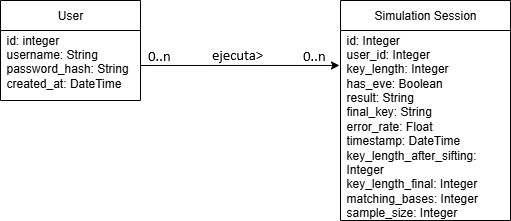
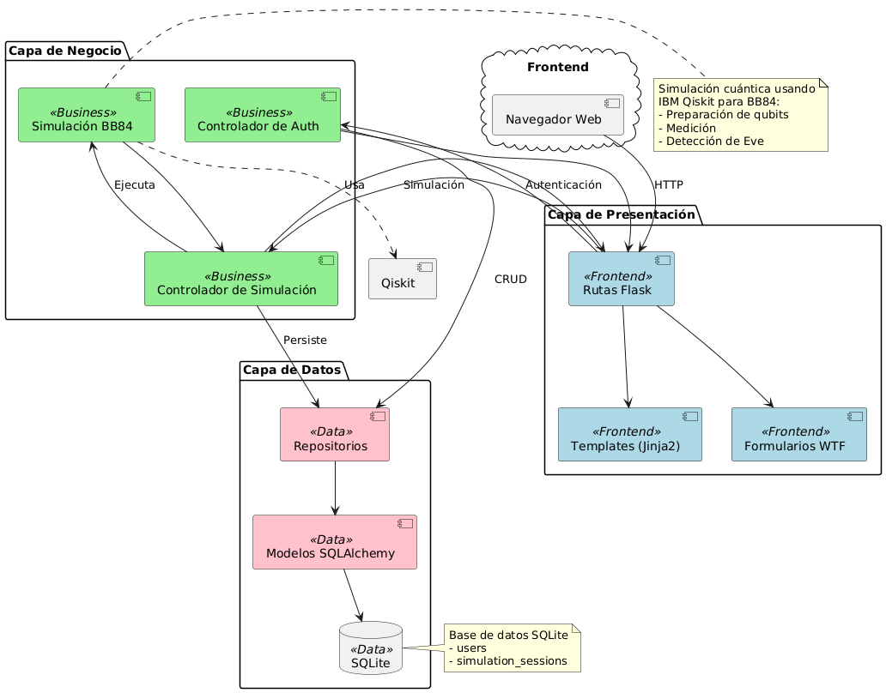

# Q-Sec: Simulador Interactivo del Protocolo de Criptografía Cuántica BB84

## Descripción del proyecto

**Q-Sec** es un sistema web con fines educativos que simula el protocolo de Distribución Cuántica de Claves (QKD) **BB84**. El objetivo principal es permitir a los usuarios ejecutar una simulación paso a paso de como funciona el protocolo **BB84**, permitiendo visualizar los resultados y asé poder entender cómo la mecánica cuántica hace posible una comunicación segura y la detección de intrusos. 

El alcance del proyecto comprende el desarrollo de una aplicación web que permite a los usuarios registrarse, ejecutar simulaciones interactivas, visualizar los resultados obtenidos y almacenar sus simulaciones para su posterior consulta. 

## Modelo de Dominio

El modelo de dominio se centra en dos entidades principales:

*   **Usuario**: Representa a la persona que utiliza el simulador.
*   **SesionIntercambio**: Almacena el resultado de cada simulación ejecutada por un usuario.
  
## Bosquejo de Arquitectura

El sistema está diseñado bajo una estricta **arquitectura de 3 capas**:

1.  **Capa de Presentación**: Se encarga de renderizar la interfaz de usuario web, gestionar las peticiones HTTP y mostrar los resultados de la simulación. 
2.  **Capa de Negocio**: Contiene toda la lógica central del proyecto, donde se simula la preparación, transmisión y medición de qubits, aplicando los principios del protocolo BB84. Aquí también se implementan las reglas de negocio, como la detección de espionaje basada en la tasa de error cuántico, y se valida con tests unitarios usando.
3.  **Capa de Datos**: Gestiona la persistencia de la información, se encarga de almacenar y recuperar los datos de los usuarios y los resultados de las sesiones de intercambio.

## Requerimientos

De que en adelante utilizaremos los nombres de "Alice", "Bob" y "Eve" para referinos al emesior, receptor y espía del mensaje respectivamente.

### Funcionales

*   **RF01**: El sistema debe permitir el registro y autenticación de usuarios.
*   **RF02**: Un usuario autenticado debe poder iniciar una nueva "Sesión de Intercambio de Clave".
*   **RF03**: Al iniciar una sesión, el usuario debe poder configurar sus parámetros: la longitud de la clave inicial y si desea incluir un espía en la simulación.
*   **RF04**: El sistema debe ejecutar la simulación del protocolo BB84 completo:
    *   a. Generación de bits y bases aleatorias por parte de Alice.
    *   b. Codificación de los bits en qubits.
    *   c. Interceptación y reenvío de qubits por parte de Eve.
    *   d. Generación de bases aleatorias y medición de qubits por parte de Bob.
    *   e. Comparación pública de bases para filtrar la clave.
    *   f. Verificación de la tasa de error para detectar a Eve.
*   **RF05**: El sistema debe almacenar en la base de datos el resultado de cada sesión: la configuración, si la clave fue segura o comprometida, y la clave final (si es segura).
*   **RF06**: El usuario debe poder ver un historial de sus sesiones de intercambio pasadas con sus resultados.

### No Funcionales

#### Portability

**Obligatorios**
- El sistema debe funcionar correctamente en múltiples navegadores (Sólo Web).

#### Security

**Obligatorios**
- Todas las contraseñas deben guardarse con encriptado criptográfico (SHA o equivalente).
- Todas los Tokens / API Keys o similares no deben exponerse de manera pública.

#### Maintainability

**Obligatorios**
- El sistema debe diseñarse con la arquitectura en 3 capas. (Ver [checklist_capas.md](checklist_capas.md))
- El sistema debe utilizar control de versiones mediante GIT.}
- El sistema debe estar programado en Python 3.9 o superior.

#### Scalability

**Obligatorios**
- El sistema debe funcionar desde una ventana normal y una de incógnito de manera independiente.
   - Aclaración: No se debe guardar el usuario en una variable local, deben usarse Tokens, Cookies o similares.

#### Performance

**Obligatorios**
- El sistema debe funcionar en un equipo hogareño estándar. 

#### Flexibility

**Obligatorios**
- El sistema debe utilizar una base de datos SQL o NoSQL.

## Stack Tecnológico

### Capa de Datos

*   **Base de Datos: SQLite**
    * Se eligió SQLite por su simplicidad y portabilidad. Al ser una base de datos serverless que se almacena en un único archivo, es ideal para un proyecto de esta escala, eliminando la necesidad de configurar un servidor de base de datos separado.
*   **ORM: SQLAlchemy**
    * SQLAlchemy es un ORM que permite interactuar con la base de datos utilizando objetos de Python, lo que abstrae las consultas SQL y facilita la gestión de los datos de manera orientada a objetos.

### Capa de Negocio

*   **Simulación Cuántica: IBM Qiskit**
    * Qiskit es el framework de código abierto para la computación cuántica que proporciona las herramientas necesarias para crear y manipular circuitos cuánticos, lo que lo hace perfecto para simular protocolo BB84.
*   **Testing: Pytest**
    * Se seleccionó Pytest para validar las reglas de negocio, como el cálculo de la tasa de error y la detección de espionaje.

### Capa de Presentación

*   **Framework Web: Flask**
    * Se eligio Flask por ser un microframework web ligero, modular y fácil de aprender. Lo cual lo hace ideal para este proyecto, permitendo un desarrollo rápido de la interfaz de usuario.
